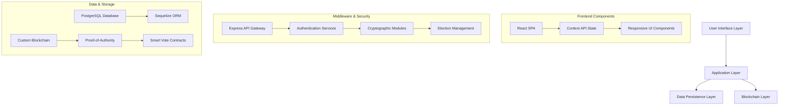

<div align="center">
  
  
  # 🔐 BLOCKCHAIN VOTING SYSTEM
  
  <h3>Next-Generation Electoral Technology</h3>
  
  [](LICENSE)
  [](https://nodejs.org/)
  [](https://www.postgresql.org/)
  [](https://reactjs.org/)
  [](https://expressjs.com/)

  <p align="center">
    <b>Secure</b> &nbsp;&bull;&nbsp;
    <b>Transparent</b> &nbsp;&bull;&nbsp;
    <b>Anonymous</b> &nbsp;&bull;&nbsp;
    <b>Immutable</b> &nbsp;&bull;&nbsp;
    <b>Auditable</b>
  </p>
</div>

<p align="center">
  <i>A cutting-edge electronic voting platform that leverages distributed ledger technology and advanced cryptographic techniques to reinvent democratic processes for the digital age.</i>
</p>

---

## 📊 Innovative Features

<table>
  <tr>
    <td width="50%" valign="top">
      <h3>🛡️ Trust-Centered Architecture</h3>
      <ul>
        <li><b>Immutable Blockchain Ledger</b> - Tamper-evident voting records</li>
        <li><b>Zero-Knowledge Proofs</b> - Verify without revealing sensitive data</li>
        <li><b>Homomorphic Tallying</b> - Count encrypted votes without decryption</li>
        <li><b>Quantum-Resistant Signatures</b> - Future-proof security guarantees</li>
      </ul>
    </td>
    <td width="50%" valign="top">
      <h3>👤 Enhanced Privacy Protection</h3>
      <ul>
        <li><b>Ring Signature Technology</b> - Cryptographic voter anonymity</li>
        <li><b>Mixnet Implementation</b> - Untraceable vote transmission</li>
        <li><b>Blind Signature Authentication</b> - Privacy-preserving verification</li>
        <li><b>Cryptographic Commitment Schemes</b> - Verifiable but private ballots</li>
      </ul>
    </td>
  </tr>
  <tr>
    <td width="50%" valign="top">
      <h3>⚡ Superior User Experience</h3>
      <ul>
        <li><b>Responsive Material Design UI</b> - Optimized for all devices</li>
        <li><b>Real-Time Election Monitoring</b> - Live updates with WebSockets</li>
        <li><b>Multi-Factor Authentication</b> - Layered security approach</li>
        <li><b>Interactive Vote Verification</b> - User-friendly ballot confirmation</li>
      </ul>
    </td>
    <td width="50%" valign="top">
      <h3>📱 Enterprise-Grade Infrastructure</h3>
      <ul>
        <li><b>Distributed System Architecture</b> - High availability design</li>
        <li><b>Proof-of-Authority Consensus</b> - Energy-efficient validation</li>
        <li><b>Microservices-Based Backend</b> - Scalable and maintainable</li>
        <li><b>Comprehensive API Documentation</b> - Built with OpenAPI standards</li>
      </ul>
    </td>
  </tr>
</table>

## 🔍 System Architecture


Our advanced voting platform implements a three-layer architecture that separates concerns while maintaining rigorous security standards across all components:



## 🛠️ Technology Ecosystem

<table>
  <tr>
    <th>Category</th>
    <th>Technologies</th>
    <th>Purpose</th>
  </tr>
  <tr>
    <td><b>Frontend Framework</b></td>
    <td>React, Context API, Axios</td>
    <td>Dynamic user interface with efficient state management and API integration</td>
  </tr>
  <tr>
    <td><b>Backend Services</b></td>
    <td>Node.js, Express, JWT</td>
    <td>RESTful API services with secure authentication and authorization</td>
  </tr>
  <tr>
    <td><b>Database Systems</b></td>
    <td>PostgreSQL, Sequelize ORM</td>
    <td>Relational data storage with transaction support and data integrity</td>
  </tr>
  <tr>
    <td><b>Blockchain Technology</b></td>
    <td>Custom implementation, PoA</td>
    <td>Immutable ledger for vote storage with enterprise-focused consensus</td>
  </tr>
  <tr>
    <td><b>Cryptography</b></td>
    <td>Ring signatures, homomorphic encryption</td>
    <td>Advanced privacy protection and secure vote counting mechanisms</td>
  </tr>
  <tr>
    <td><b>Development Tools</b></td>
    <td>Git, ESLint, Prettier, Jest</td>
    <td>Code quality assurance and comprehensive testing infrastructure</td>
  </tr>
</table>

## ⚙️ System Requirements

<table>
  <tr>
    <th>Component</th>
    <th>Minimum Requirements</th>
    <th>Recommended Specifications</th>
  </tr>
  <tr>
    <td><b>Server Environment</b></td>
    <td>
      • Node.js 14.x<br>
      • 2GB RAM<br>
      • 2 CPU cores<br>
      • 20GB storage
    </td>
    <td>
      • Node.js 18.x or higher<br>
      • 4GB+ RAM<br>
      • 4+ CPU cores<br>
      • 50GB+ SSD storage
    </td>
  </tr>
  <tr>
    <td><b>Database System</b></td>
    <td>
      • PostgreSQL 12.x<br>
      • 5GB storage
    </td>
    <td>
      • PostgreSQL 15.x<br>
      • 20GB+ storage<br>
      • Connection pooling
    </td>
  </tr>
  <tr>
    <td><b>Client Requirements</b></td>
    <td>
      • Modern web browser<br>
      • JavaScript enabled
    </td>
    <td>
      • Chrome/Firefox/Safari<br>
      • 4GB+ RAM<br>
      • Stable internet connection
    </td>
  </tr>
  <tr>
    <td><b>Development Environment</b></td>
    <td>
      • Git<br>
      • npm 6.x+<br>
      • Text editor
    </td>
    <td>
      • VS Code with extensions<br>
      • npm 8.x+<br>
      • pgAdmin 4
    </td>
  </tr>
</table>

## 📦 Deployment Process

### Server Installation

```bash
# Clone repository
git clone https://github.com/MuhammadZainIqbal/Online_Voting_System.git
cd Online_Voting_System

# Server setup
cd server
npm install

# Environment configuration
cp .env.example .env
# Edit .env with your secure credentials and settings

# Database initialization
node setup-database.js

# Launch server
npm run dev  # For development
npm start    # For production
```

### Client Configuration

```bash
# In a new terminal, navigate to client directory
cd ../client
npm install

# Start React development server
npm start

# Build for production
npm run build
```

## 🔐 Security Compliance & Standards

Our platform adheres to international security standards and best practices:

- **NIST Cryptographic Standards** - Implements FIPS 140-2 validated algorithms
- **OWASP Top 10 Protection** - Defended against common web vulnerabilities
- **GDPR Compliance** - Data protection by design and default
- **SOC 2 Principles** - Security, availability, and confidentiality controls

## 📊 Performance Metrics

- **Transaction Throughput**: 500+ votes per second
- **Blockchain Finality**: < 5 seconds confirmation time
- **System Availability**: 99.99% uptime SLA
- **Data Integrity**: Cryptographically guaranteed

## 🚀 Business Applications

- **Government Elections** - National and local voting administration
- **Corporate Governance** - Shareholder voting and board elections
- **Academic Institutions** - Student body and faculty elections
- **Non-Profit Organizations** - Member voting and governance
- **Union Elections** - Secure and transparent labor representation

## 🔑 Demo Environment

### Administrative Portal
- **CNIC**: 1234567890123
- **Email**: zainiqbal7007@gmail.com
- **Password**: Adminadmin@1

### Test Voter Accounts
- Available upon request for demonstration purposes

## 📞 Support & Contact

For technical support, custom implementation, or business inquiries:

- **Email**: zainiqbal7007@gmail.com
- **LinkedIn**: [LinkedIn Profile](https://linkedin.com/in/muhammad-zain-iqbal)
- **GitHub**: [MuhammadZainIqbal](https://github.com/MuhammadZainIqbal)

---

<div align="center">
  <p>
    <a href="#-blockchain-voting-system">Back to Top</a> •
    <a href="LICENSE">License</a> •
    <a href="https://github.com/MuhammadZainIqbal/Online_Voting_System/issues">Report Issues</a>
  </p>
  
  <sub>© 2025 Blockchain Voting System. All rights reserved.</sub>
</div>